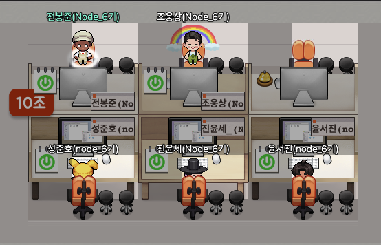
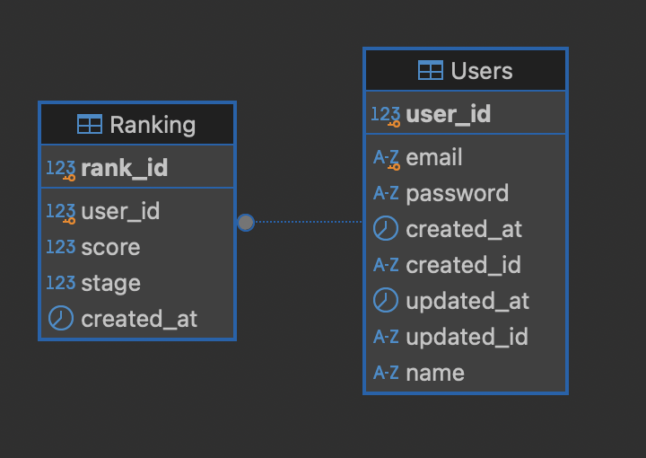
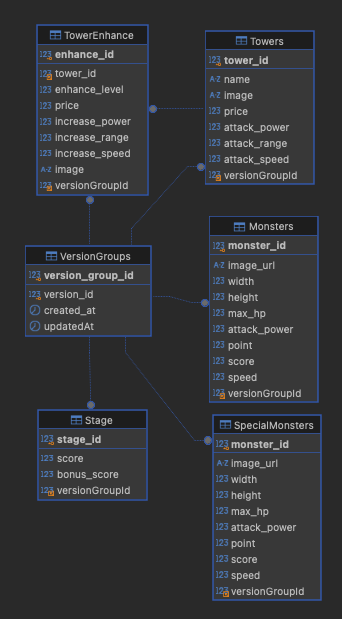
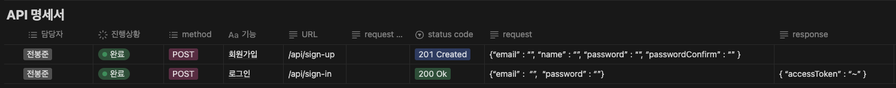
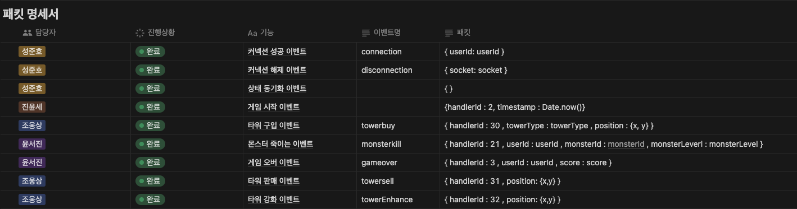

# 타워 디펜스

> [ 내일배움캠프 Node.js 6기 ] 팀 프로젝트

## 타워 짓고 10조

## 팀원 소개



|                                                전봉준                                                 |                                                 조웅상                                                 |                                                성준호                                                 |                                                 진윤세                                                 |                                                 윤서진                                                 |
| :---------------------------------------------------------------------------------------------------: | :----------------------------------------------------------------------------------------------------: | :---------------------------------------------------------------------------------------------------: | :----------------------------------------------------------------------------------------------------: | :----------------------------------------------------------------------------------------------------: |
|                                                 INTP                                                  |                                                  INTP                                                  |                                                 ISTP                                                  |                                                  INFJ                                                  |                                                  INFP                                                  |
| <p></p> | <p></p> | <p></p> | <p></p> | <p></p> |
|                              [@devbong92](https://github.com/devbong92)                               |                                  [@P-lani](https://github.com/P-lani)                                  |                                  [@sj98h](https://github.com/sj98h)                                   |                                [@JinYunSe](https://github.com/JinYunSe)                                |                                 [@yth0417](https://github.com/yth0417)                                 |
|                                 [Blog Link](https://velog.io/@vamuzz)                                 |                                [Blog Link](https://p-lani.tistory.com/)                                |                                 [Blog Link](https://velog.io/@sj98h)                                  |                                 [Blog Link](https://velog.io/@yth0417)                                 |                             [Blog Link](https://kagan-draca.tistory.com/)                              |

## 시연영상

- YOUTUBE LINK

## 프로젝트 소개

### 필수기능

- [ ] 회원가입 / 로그인 기능
- [ ] 유저 별 데이터 관리
- [ ] 클라이언트가 서버로부터 수신하는 이벤트 종류
  - [ ] 커넥션 성공 이벤트
  - [ ] 커넥션 실패 이벤트
  - [ ] 상태 동기화 이벤트
- [ ] 클라이언트가 서버로 송신하는 이벤트 종류
  - [ ] 게임 시작 이벤
  - [ ] 최초 타워 추가 이벤트 (제거, 초기 골드 지급으로 변경)
  - [ ] 타워 구입 이벤트
  - [ ] 몬스터 죽이는 이벤트
  - [ ] 게임 오버 이벤트
- [ ] 유저 별 최고 기록 스코어 저장

### 도전기능

- [ ] 타워 환불 기능
- [ ] 타워 강화 기능
- [ ] 황금 고블린 출연 기능

-

## ERD

### USER DB (MySQL)



### GAME DB (MySQL)



### REDIS

- META DATA

- USER DATA

## 패킷 및 API 명세서




## 프로젝트 구조

```
📁 ROOT
├── README.md
├── 📁 config
│   └── winston.config.js                                   // winston 설정
├── 📁 docs                                                 // README 관련
│   └── team_image.png
├── package.json
├── 📁 prisma                                               // 프리즈마 관련
│   ├── 📁 game
│   │   └── game.prisma                                     // GAME DB 설정
│   └── 📁 user
│       └── user.prisma                                     // USER DB 설정
├── 📁 public                                               // 클라이언트 관련
│   ├── base.js
│   ├── game.js                                             // 게임 관련
│   ├── gameUtils.js                                        // 게임 기능 관련
│   ├── 📁 images
│   ├── index.html
│   ├── login.html
│   ├── monster.js
│   ├── rank.css
│   ├── rank.html
│   ├── register.html
│   ├── socket.js                                           // 소켓 통신 관련
│   ├── specialmonster.js
│   ├── tower.js
│   └── utils.js
├── 📁 src                                                  // 서버 관련
│   ├── app.js
│   ├── 📁 controllers                                      // 컨트롤러
│   │   ├── ranks.controller.js
│   │   ├── schedule.controller.js
│   │   └── users.controller.js
│   ├── 📁 errors                                           // 에러
│   │   └── status.error.js
│   ├── 📁 handlers                                         // 핸들러
│   │   ├── game.handler.js
│   │   ├── handlerMapping.js
│   │   ├── helper.js
│   │   ├── monster.handler.js
│   │   ├── ranking.handler.js
│   │   ├── register.handler.js
│   │   ├── stage.handler.js
│   │   └── tower.handler.js
│   ├── 📁 init                                             // 서버 기동시 동작 관련
│   │   ├── initData.js                                     // 메타 데이터 처리
│   │   ├── redis.js                                        // 레디스 클라이언트 세팅
│   │   └── socket.js                                       // 소켓 세팅
│   ├── 📁 middlewares
│   │   └── error.middleware.js
│   ├── 📁 models                                           // 모델 (Redis)
│   │   ├── gold.model.js
│   │   ├── mEnhance.model.js
│   │   ├── mMonster.model.js
│   │   ├── mSpecialMonster.model.js
│   │   ├── mStages.model.js
│   │   ├── mTower.model.js
│   │   ├── mVersion.model.js
│   │   ├── monster.model.js
│   │   ├── rank.model.js
│   │   ├── sample.model.js
│   │   ├── score.model.js
│   │   ├── spawnspecialmonster.model.js
│   │   ├── specialmonster.model.js
│   │   ├── stage.model.js
│   │   ├── token.model.js
│   │   ├── tower.model.js
│   │   └── user.model.js
│   ├── 📁 repositories                                     // 레포지토리 (MySQL)
│   │   ├── enhance.repository.js
│   │   ├── monsters.repository.js
│   │   ├── ranks.repository.js
│   │   ├── specialmonster.repository.js
│   │   ├── stages.repository.js
│   │   ├── towers.repository.js
│   │   └── users.repository.js
│   ├── 📁 routers                                          // 라우터
│   │   ├── ranks.router.js
│   │   └── users.router.js
│   ├── 📁 services                                         // 서비스
│   │   ├── gamestart.service.js
│   │   ├── ranks.service.js
│   │   └── users.service.js
│   └── 📁 utils                                            // 유틸
│       ├── auth.utils.js
│       ├── joi.utils.js
│       ├── monster.utils.js
│       ├── mymath.js
│       └── 📁 prisma                                       // 프리즈마 세팅
│           └── index.js
└── yarn.lock
```

## 담당 업무

- 전봉준 [(LINK)](<(https://github.com/dev-node-teams/sparta-10-tower-defense/wiki/%F0%9F%91%A8%F0%9F%8F%BB%E2%80%8D%F0%9F%92%BB-%EB%8B%B4%EB%8B%B9-%EC%97%85%EB%AC%B4-%EC%A0%84%EB%B4%89%EC%A4%80)>)

- 조웅상 [(LINK)](<(https://github.com/dev-node-teams/sparta-10-tower-defense/wiki/%F0%9F%91%A8%F0%9F%8F%BB%E2%80%8D%F0%9F%92%BB-%EB%8B%B4%EB%8B%B9-%EC%97%85%EB%AC%B4-%EC%A1%B0%EC%9B%85%EC%83%81)>)

- 성준호 [(LINK)](<(https://github.com/dev-node-teams/sparta-10-tower-defense/wiki/%F0%9F%91%A8%F0%9F%8F%BB%E2%80%8D%F0%9F%92%BB-%EB%8B%B4%EB%8B%B9-%EC%97%85%EB%AC%B4-%EC%84%B1%EC%A4%80%ED%98%B8)>)

- 진윤세 [(LINK)](<(https://github.com/dev-node-teams/sparta-10-tower-defense/wiki/%F0%9F%91%A8%F0%9F%8F%BB%E2%80%8D%F0%9F%92%BB-%EB%8B%B4%EB%8B%B9-%EC%97%85%EB%AC%B4-%EC%A7%84%EC%9C%A4%EC%84%B8)>)

- 윤서진 [(LINK)](<(https://github.com/dev-node-teams/sparta-10-tower-defense/wiki/%F0%9F%91%A8%F0%9F%8F%BB%E2%80%8D%F0%9F%92%BB-%EB%8B%B4%EB%8B%B9-%EC%97%85%EB%AC%B4-%EC%9C%A4%EC%84%9C%EC%A7%84)>)

## 프로젝트 소감

- 이미지
